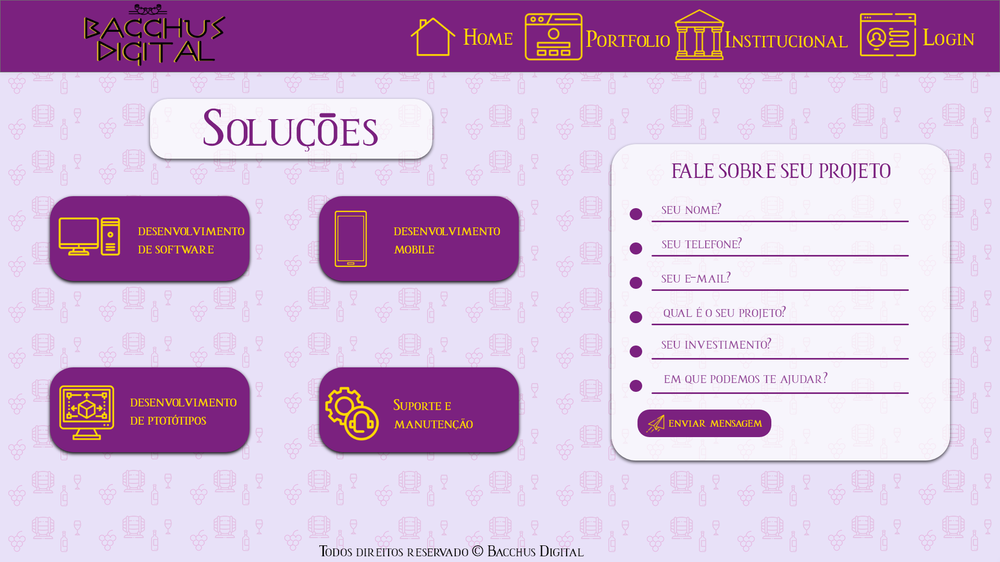
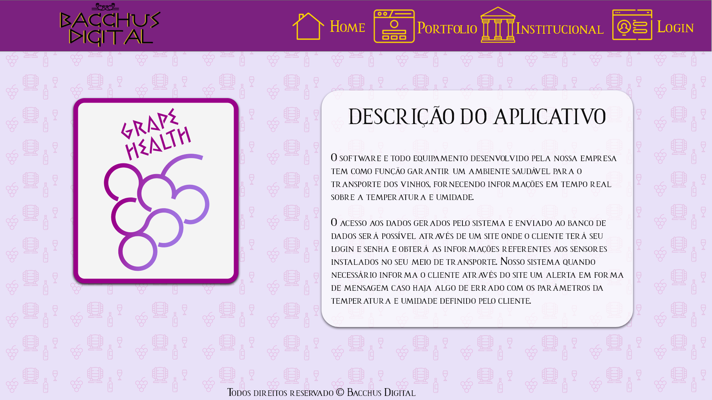
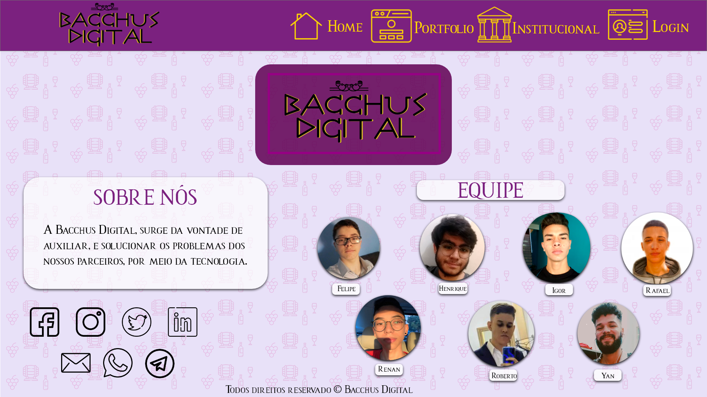
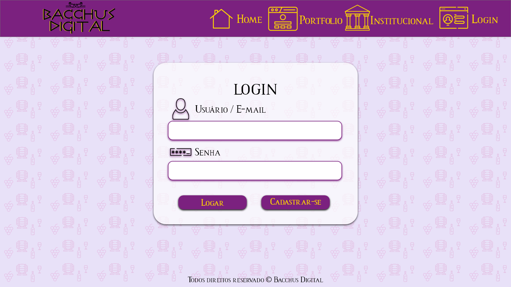
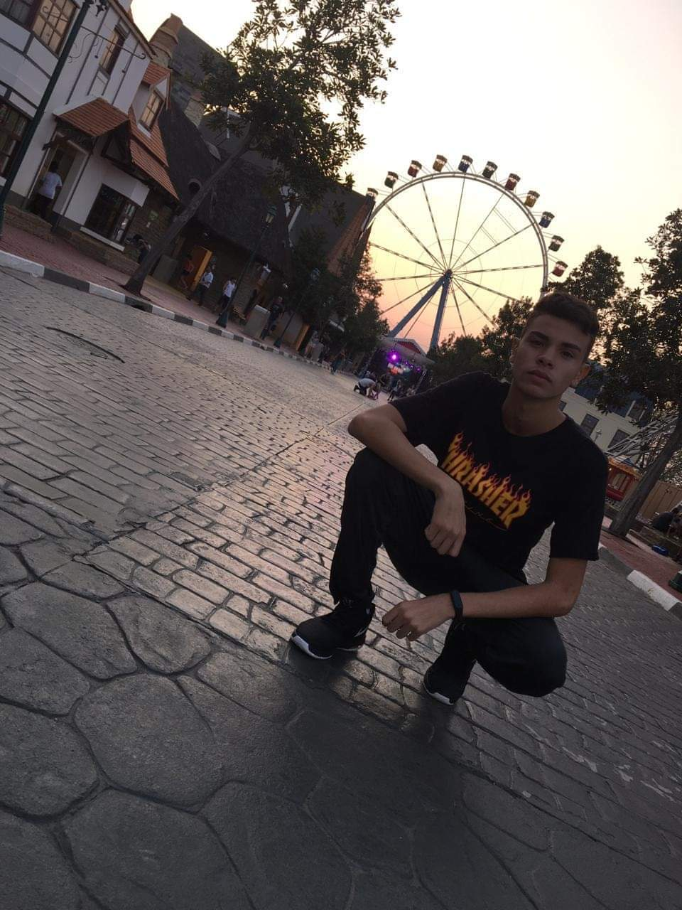
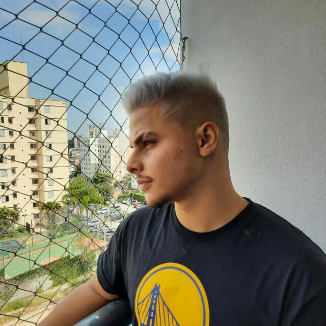
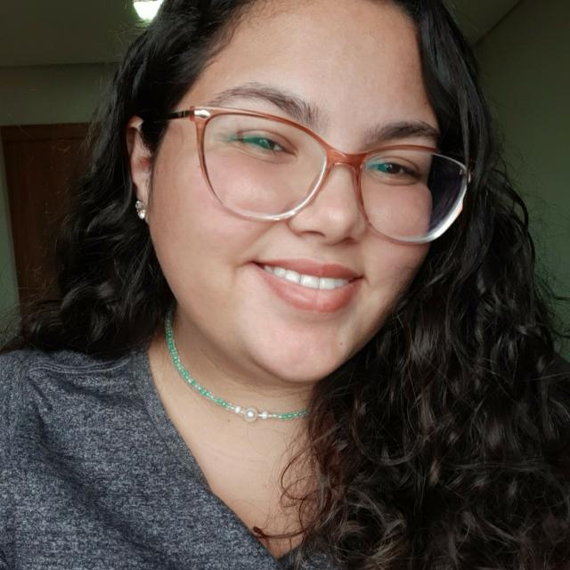
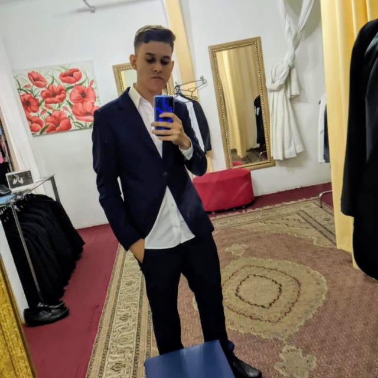

<h1 align="center">
    
</h1>

<h4 align="center"> 
	🚧  Grape Health 🍇🍇🍇 em construção  🚧
</h4>

<p align="center">
 <a href="#-sobre-o-projeto">Sobre</a> •
 <a href="#-funcionalidades">Funcionalidades</a> •
 <a href="#-layout">Layout</a> • 
 <a href="#-como-executar-o-projeto">Como executar</a> • 
 <a href="#-tecnologias">Tecnologias</a> • 
 <a href="#-autor">Autor</a> • 
</p>

## 💻 Sobre o projeto

🍇 Descrição do projeto muito doidjho

---

## ⚙️ Funcionalidades

- [x] Func01

  - [x] BlaBlaBlaBla
  - [x] BlaBlaBlaBla
  - [x] BlaBlaBlaBla

- [x] Func02

  - [x] BlaBlaBlaBla
  - [x] BlaBlaBlaBla

- [x] Func03

  - [x] BlaBlaBlaBla
  - [x] BlaBlaBlaBla
  - [x] BlaBlaBlaBla

---

## 🎨 Layout

O layout da aplicação está disponível no Figma:

<a href="https://www.figma.com/file/CnJSMHXQ4WnsyggtMawtni/Untitled?node-id=1%3A2">
  
</a>

### Prints

<p align="center" style="display: flex; align-items: flex-start; justify-content: center;">
  
    
</p>
<p align="center" style="display: flex; align-items: flex-start; justify-content: center;">
  
  
</p>

---

## 🚀 Como executar o projeto

### Pré-requisitos

Antes de começar, você vai precisar ter instalado em sua máquina as seguintes ferramentas:
[Git](https://git-scm.com), [Node.js](https://nodejs.org/en/).
Além disto é bom ter um editor para trabalhar com o código como [VSCode](https://code.visualstudio.com/)


#### 🧭 Rodando a aplicação web (Frontend)

```bash

# Clone este repositório
$ git clone https://github.com/AntonioGally/BacchusDigital.git

# Acesse a pasta do projeto no seu terminal/cmd
$ cd BacchusDigital

# Abra com VsCode
$ code .
```


## 🛠 Tecnologias

As seguintes ferramentas foram usadas na construção do projeto:

#### **Website** ([HTML](https://developer.mozilla.org/pt-BR/docs/Web/HTML) + [CSS](https://www.w3schools.com/css/) + [JavaScript](https://developer.mozilla.org/pt-BR/docs/Web/JavaScript))

- **[Bootstrap](https://getbootstrap.com)**
- **[Git](https://github.com)**
- **[GitHub](https://github.com)**

## 💪 Como contribuir para o projeto

1. Faça um **fork** do projeto.
2. Crie uma nova branch com as suas alterações: `git checkout -b my-feature`
3. Salve as alterações e crie uma mensagem de commit contando o que você fez: `git commit -m "feature: My new feature"`
4. Envie as suas alterações: `git push origin my-feature`

---

## 🦸 Autores
- Antônio Gally
- Igor Sérgio
- Bruno Silva
- Rafaela Amancio
- Roberto Alves
- Ítalo Gonçalves

<p style="display:flex; align-items:center" align="center"> 



  







</P>


---
